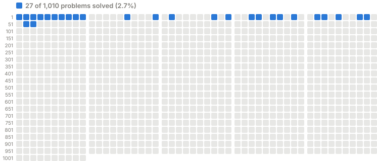

# project_euler

Each square is a problem; filled squares are solved. A solution counts once a `.py` file at the repo root links to its problem on the first line (`# https://projecteuler.net/problem=N`). A pre-push hook redraws the grid; enable it with `git config core.hooksPath .githooks`.
